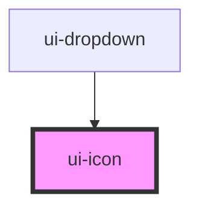

# ui-icon

<!-- Auto Generated Below -->

## Properties

| Property | Attribute | Description | Type                                                                                         | Default            |
| -------- | --------- | ----------- | -------------------------------------------------------------------------------------------- | ------------------ |
| `color`  | `color`   |             | `"black" \| "gray-200" \| "white"`                                                           | `'black'`          |
| `name`   | `name`    |             | `"cheveron-down" \| "cheveron-left" \| "cheveron-right" \| "cheveron-up" \| "cog" \| "help"` | `'cheveron-right'` |
| `size`   | `size`    |             | `"md" \| "sm" \| "xs"`                                                                       | `'sm'`             |

## Dependencies

### Used by

 - [ui-dropdown](../ui-dropdown)

### Graph

----------------------------------------------

*Built with [StencilJS](https://stenciljs.com/)*
