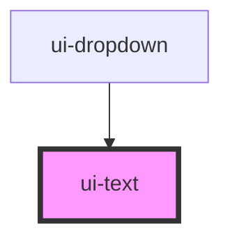

# ui-text

<!-- Auto Generated Below -->

## Properties

| Property | Attribute | Description | Type                                             | Default      |
| -------- | --------- | ----------- | ------------------------------------------------ | ------------ |
| `color`  | `color`   |             | `"black" \| "blue-900" \| "gray-200" \| "white"` | `'blue-900'` |
| `size`   | `size`    |             | `"base" \| "lg" \| "sm" \| "xl" \| "xs"`         | `'base'`     |
| `weight` | `weight`  |             | `"bold" \| "normal" \| "thin"`                   | `'normal'`   |

## Dependencies

### Used by

 - [ui-dropdown](../ui-dropdown)

### Graph

----------------------------------------------

*Built with [StencilJS](https://stenciljs.com/)*
